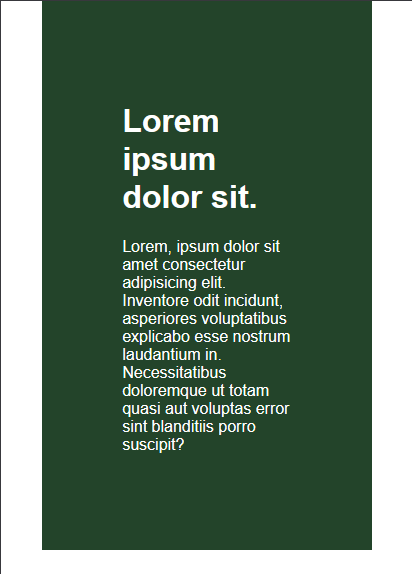
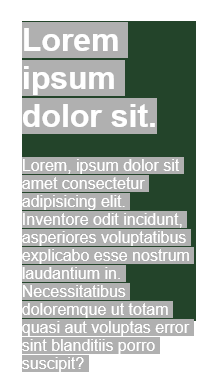

# Why It's a good idea to avoid heights

### - **When we use height the page becomes less responsive & the content inside parent overflows.**

### - **Even when we give overflow hidden property to parent element the content overflows to right side and user has to scroll horizontally in mobile devices.**

### - **If we give overflow hidden property to child element the content will hide and user can't see it even they scroll page.** 😟

### - **_So it's better to use padding instead of height & one more thing give padding value in em or rem (16px = 1em)_** 😃

 

### _Used padding to stop content from overflowing._

 

### _Used height but the content is overflowing._
